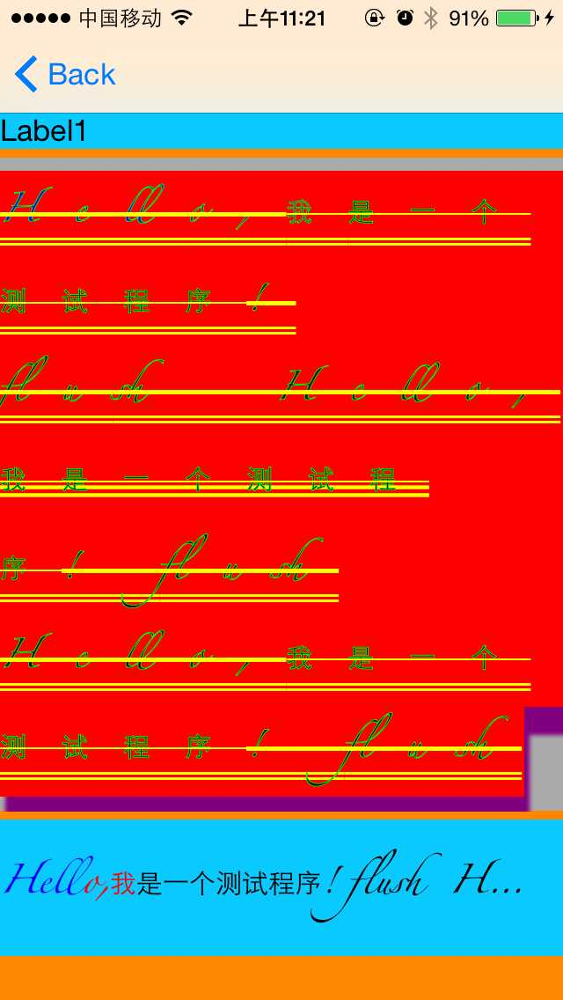
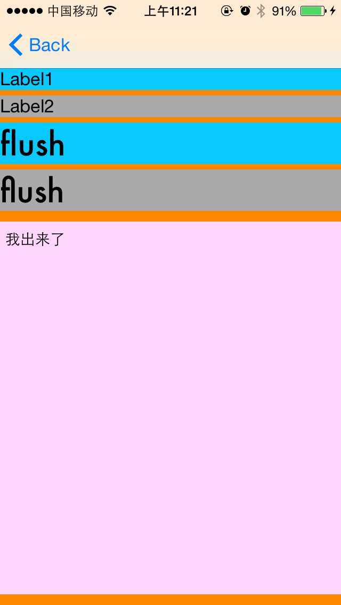
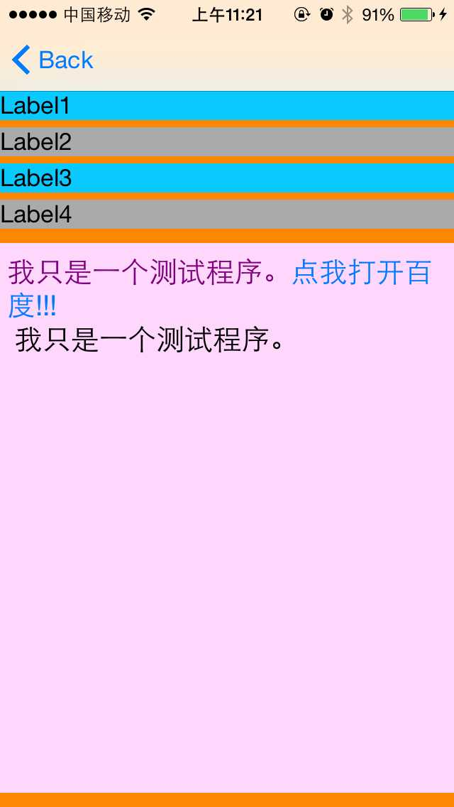
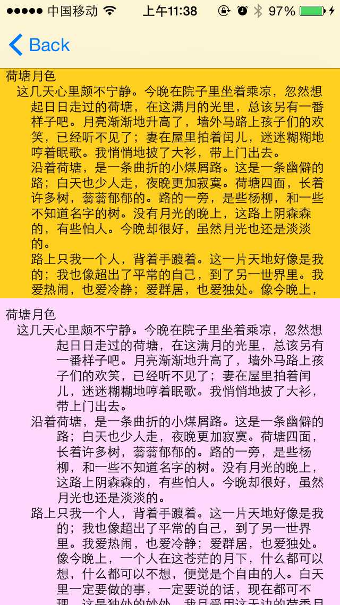

# 图文混排
## webView图文混排
 * 事例代码通过简单地例子展示了图文混排  
 * 简单地添加了电机图片的处理时间 
要感谢网易提供了数据 ，事例代码的数据来自抓的网易新闻的数据 
展示效果如下 
 

## NSAttributedString 进行图文混排
### Label的效果展示
 * 总共有11 种效果
 
 
 
 
 
 
 
 
 
 
 
 
### TextView的效果展示
 * 总共有13 种效果 
 
 
 
 
 
 
 
 
 
 
 
 
